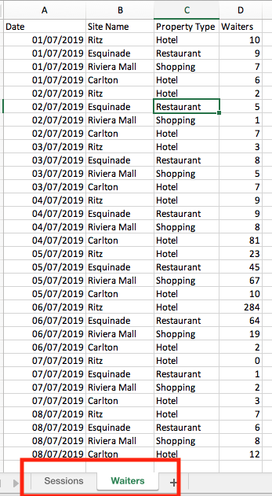

---
jupytext:
  cell_metadata_filter: all, -hidden, -heading_collapsed, -run_control, -trusted
  notebook_metadata_filter: all, -jupytext.text_representation.jupytext_version, -jupytext.text_representation.format_version,
    -language_info.version, -language_info.codemirror_mode.version, -language_info.codemirror_mode,
    -language_info.file_extension, -language_info.mimetype, -toc
  text_representation:
    extension: .md
    format_name: myst
kernelspec:
  display_name: Python 3 (ipykernel)
  language: python
  name: python3
language_info:
  name: python
  nbconvert_exporter: python
  pygments_lexer: ipython3
---

# dessins par groupby

et accessoirement, lire plusieurs feuillets depuis excel

{download}`mais commencez par télécharger le zip<./ARTEFACTS-groupby-draw.zip>`

+++

le fichier excel `data/groupby-draw.xlsx` contient ici plusieurs feuillets

+++



+++

les deux feuillets contiennent 2 données différentes pour les mêmes sites / dates

+++

## ce qu'il faut faire

+++

A. visualiser les deux données (Sessions et Waiters) en fonction du temps par site

e.g.


+++

B. mêmes chiffres mais agrégés sur les sites, les deux caratéristiques sur une seule figure (ici avec seaborn)


```{code-cell} ipython3
# à vous

# imports ...
```

```{code-cell} ipython3
df = ...
```

---
